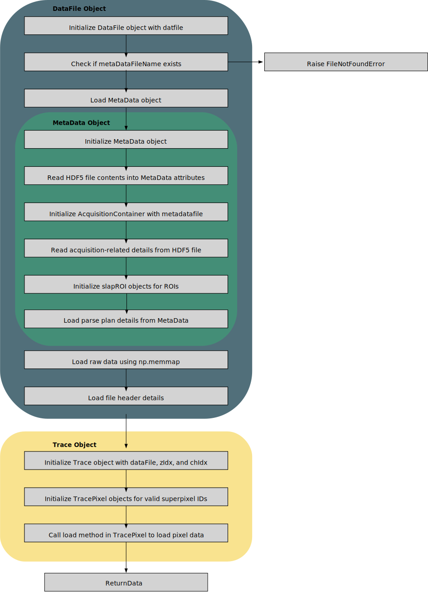

# Summary

Two-photon microscopy is an important technique for deep, *in vivo*, recordings of neuronal activity from fluorescent biosensors. However, the neural activity frequently occurs at orders of magnitude faster than what a typical laser-scanning two-photon microscope can record. To overcome this limitation, several novel scanning techniques have been developed, resulting in neural data being stored in complicated file structures rather than typical image formats. We present our Python toolbox with customized codes that interact with such a data structure generated from a novelly designed two-photon microscope, SLAP2, capable of recording neural activity at kilohertz. The ability to import the data structure in Python also enables the implementation of other python scripts and libraries. This Python package includes many different features that accompany the SLAP2 microscope in a separate MATLAB UI, from motion correction on ROI to  importing Python scripts and allows quick visualization of imaged results. 

# Statement of need

To overcome the inherent speed limitations of two-photon imaging, the Scanned Line Angular Projection (SLAP) microscope was developed to make use of elements of random-access and projection microscopy to increase the acquisition rate of two-photon imaging for the recording of neuronal activity [@Kazemipour2019]. The second generation of this technology builds upon these concepts in the designs of SLAP2, a commercially available microscope kit [@mbfSLAP2]. However, the custom tools needed to read data from the binary files generated during high-speed acquisitions of neural activity in specific region of interest (ROI) and are written outside the Python programming language, making designing workflows that leverage Python ecosystem packages cumbersome. To overcome this limitation, we developed the Python library, SLAP2 Utils. Our package provides pure Python implementation of functions needed to read the raw microscope data, such that SLAP2 data can be processed in the Python environment. This enables ranges of Python libraries from copy that speeds up the running of Python programs by running scripts on GPU using CUDA libraries to Keras of Tensorflow (for machine learning) to copy that speeds up the running of Python programs by using CUDA and running scripts on a GPU.

# SLAP2 Datafile Pipeline

This paper first provides a Python version of the code provided in MBF, with an added function to organize the eventual parsed data (see Figure 1 \autoref{fig:fig1}). When a recording session is finished in the SLAP2 software, at least two files are usually produced: a .dat file and a .meta file. Both files contain many subfields of information. The .dat file contains mainly general information, from lines per cycle to the number of channels, and the .meta file contains more detailed information, including the parse plan of the recording and unparsed raw data (inside the memmap subfield). This means that a simple reading of the code is insufficient to extract the recording properly, and additional codes are needed to extract the data inside the memmap field correctly. The datafile.py python script imports other scripts, such as fileheader.py and metadata.py, that primarily read stored data inside the two files without any processing to it yet. It outputs a datafile object after it is run with the _load_file function, which contains all the extracted information in its various fields.

Before further processing, the user also needs to extract the desired ROI information. This is necessary because there are usually multiple ROIs, and the correct ROI information must be provided in its masked array form so that data can be properly extracted from memmap. This information, together with the object outputted previously, is inputted into trace.py, which eventually outputs the recorded trace of the whole ROI through the setPixelIdxs function and then the process function. As an ROI usually contains multiple pixels, the trace.py python script also imports a script called trace_pixel.py that loads information about the pixels inside the trace. The output of the process function gives an average trace of the ROI, resulting from averaging values from subpixels with a convolution algorithm that fills the empty gaps created through the parse plans. The function also outputs extracted raw data inside its TracePixel subfield, but those are not spatially sorted in terms of their stored order. Here, a customized code (independent from MBF) called orderadjust can be run, such that the TracePixel is sorted with a higher index value representing trace pixels that are located further right than a pixel with a lower index. This allows the user to examine recorded data of higher spatial resolution as the user can now visualize recordings of values in the sub_pixels of an ROI instead of one value for the whole ROI.

# SLAP2 Uility UI that Accompanies SLAP2 Software

Besides the library of python scripts that processes SLAP2 datafile, a MATLAB UI script called haasSlapUI.m are developed that accompanies the SLAP2 software. The script is written in MATLAB because some functionality of the script requires the script to directly interact the SLAP2 software, which is also written and ran in MATLAB. Although the script is written in MATLAB, the UI frequently calls on python scripts such that some functionality can be ran much faster than if it was written in MATLAB. When the script is downloaded, the path must be edited to be the local directory of the repository

# Visualization

Figures can be included like this:

and referenced from text using \autoref{fig:example}.

# Citations

# Acknowledgements

The development of this Python library was supported by funds from the Canadian Institutes of Health Research (CIHR) Foundation Award (FDN-148468).

# References
